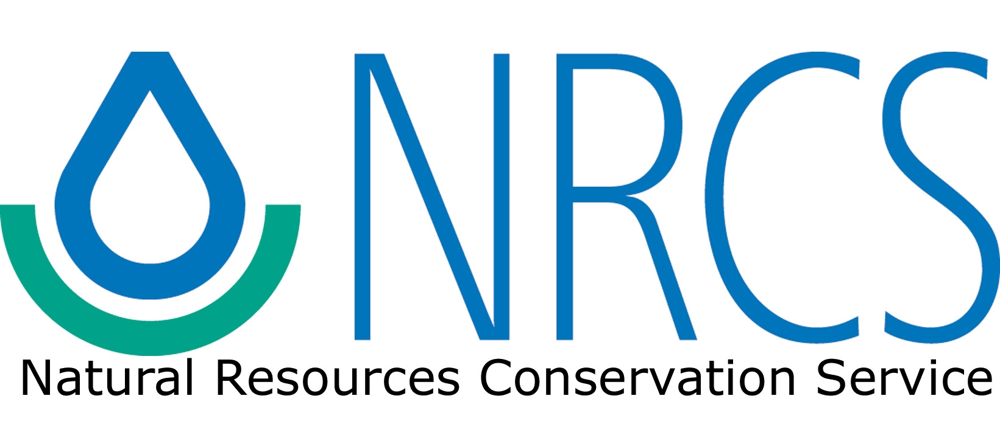

<div class="hero-section" markdown="1">

# Agricultural Image Repository
{: .fs-9 .fw-700 }

Comprehensive field-level plant image dataset with precise segmentation masks, detailed taxonomic annotations, and agricultural context for computer vision research.
{: .fs-6 .fw-300 }

</div>

{: .note }
> Access only available to USDA SciNet users. Public access coming soon.

---

## About This Project

This repository is a product of the **Digital Agricultural Systems Hub**, a collaborative research initiative advancing sustainable agriculture through precision technology and data science. **DASH** brings together researchers, farmers, and technologists to develop innovative solutions for sustainable crop production and research.

<div class="acknowledgements-simple" markdown="0">
  
<div class="sponsors-logo-grid">
  
  <div class="sponsor-logo-item primary-sponsor">
    <a href="https://digitalagsystemshub.org" title="Digital Agricultural Systems Hub">
      
    </a>
  </div>
  
  <!-- Add other partner logos as needed -->
  
</div>

</div>

---

## Dataset at a Glance

<div class="stats-grid" markdown="0">
  <div class="stat-card">
    <span class="stat-number">183K+</span>
    <span class="stat-label">Plant Images</span>
  </div>

  <div class="stat-card">
    <span class="stat-number">2.7M+</span>
    <span class="stat-label">Instances</span>
  </div>
  
  <div class="stat-card">
    <span class="stat-number">60+</span>
    <span class="stat-label">Species</span>
  </div>
  
  <div class="stat-card">
    <span class="stat-number">3</span>
    <span class="stat-label">Locations</span>
  </div>

</div>

---

## Two Complementary Databases

AgIR encompasses two distinct scene types, each with unique advantages and applications.

<div class="db-card" markdown="1">

### SEMIF - Semi-Automated Field Database

- **Environment**: Images captured in semi-controlled environments (e.g., nurseries) using the BenchBot, a gantry-like robotic system.
- **Throughput**: High-throughput collection allows for the acquisition of large amounts of data daily (over 500 images across a large nursery potting area) across 3 US locations.
- **Annotation**: Facilitated by the plain black background of weed fabric and hand weeds, enabling automatic annotation through photogrammetry, digital image processing, and deep learning.
- **Trade-offs**: While offering scalability and automation, these images may not fully represent real-world plant conditions.
Browse the sections below to learn about each database.

[Explore SEMIF →](dataset/semif.html){: .btn .btn-primary }

{: .note }
> Field DB coming soon

</div>

<!-- <div class="db-card" markdown="1">

### FIELD - Field Observation Database
**Rich agricultural context**

- 72 attributes per record
- Crop types, phenology, field conditions
- Ideal for agricultural research

[Explore FIELD →](dataset/field.html){: .btn .btn-blue }

</div> -->

---

## Quick Start

**[Explore Dataset](dataset/)** - Browse database schemas and statistics

**[Image Gallery](examples/)** - Visualize examples from select plant categories

**[Access Data](access/)** - Query and download with AgIR-CVToolkit

---

## Acknowledgements

<div class="acknowledgements-simple" markdown="0">
  
<div class="sponsors-logo-grid">
  
  <div class="sponsor-logo-item">
    <a href="#" title="USDA">
      
    </a>
  </div>
  
  <div class="sponsor-logo-item">
    <a href="#" title="Cotton Inc">
      
    </a>
  </div>
  
  <div class="sponsor-logo-item">
    <a href="#" title="American Sugarbeets Growers Associations">
      
    </a>
  </div>

  <div class="sponsor-logo-item sponsor-logo-wide">
    <a href="#" title="National Institute of Food and Agriculture">
      
    </a>
  </div>

  <div class="sponsor-logo-item">
    <a href="#" title="National Resource Convervation Service">
      
    </a>
  </div>

  <div class="sponsor-logo-item">
    <a href="#" title="United Soybean Board">
      
    </a>
  </div>

</div>

</div>

---

<!-- ## Citation

If you use the Agricultural Image Repository in your research, please cite:

```bibtex
@dataset{agir2025,
  title={Agricultural Image Repository: A Comprehensive Field-Level Plant Dataset},
  author={Your Name and Contributors},
  year={2025},
  publisher={Your Institution},
  url={https://github.com/yourusername/AgIR-CVToolkit}
}
``` -->

<!-- [More citation formats →](citation/how-to-cite.html) -->

---

## Contact & Support

- **GitHub**: [AgIR-CVToolkit Repository](https://github.com/precision-sustainable-ag/AgIR-CVToolkit)
- **Issues**: [Report bugs or request features](https://github.com/precision-sustainable-ag/AgIR-CVToolkit/issues)
- **Email**: [support@example.com](mailto:support@example.com)